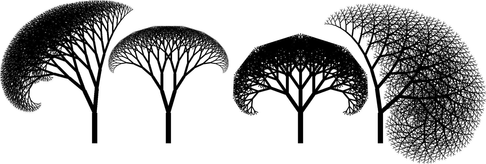
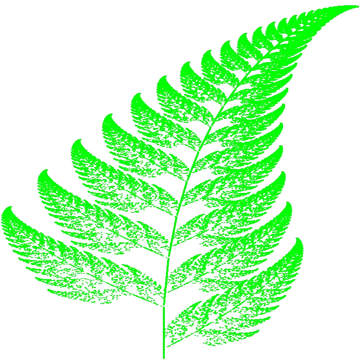

# RobloxFractalRepresentation
This is fractal maker that I did for my high school research paper:
https://drive.google.com/file/d/1npvRsUyWiMAEhDLlxjpQj7vt6vtdb2xc/view?usp=sharing

## Some fractal images make it with the code

